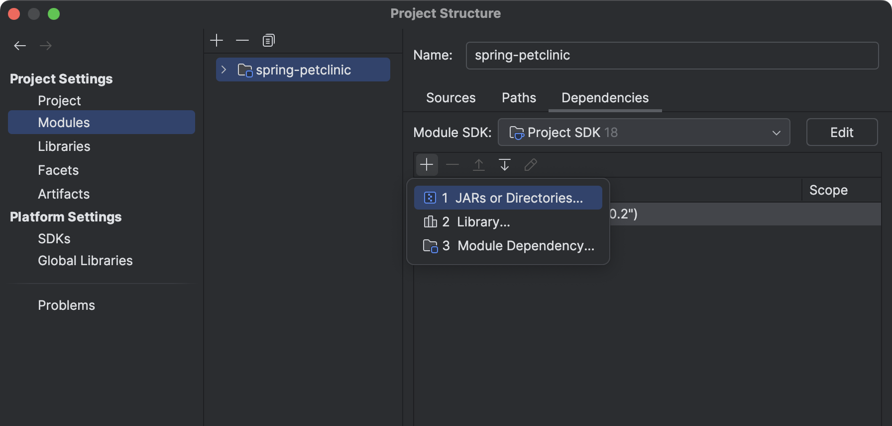
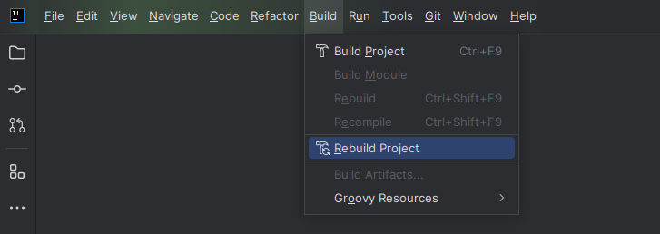

# Ema Navigator

Ema Navigator is a Java library for navigating between CLI pages within a project. 
It provides code generation to
facilitate seamless navigation between "pages"
by automatically generating methods to navigate to different classes (or "pages").
This approach is particularly useful for projects requiring a command-line interface (CLI) or
programmatic navigation within applications.

## Table of Contents

- [Features](#features)
- [Installation](#installation)
- [Usage](#usage)
    - [Extends AbstractNavigable](#extends-abstractNavigable)
    - [Generate Navigator Class](#generate-navigator-class)
    - [Navigating to Pages](#navigating-to-pages)
    - [Pop and PopUntil Methods](#pop-and-popuntil-methods)
- [License](#license)

## Features

- **Simple Navigation:** Implement your class with AbstractNavigable.
- **Parameter Passing:** Use `@Param` to indicate required parameters for a page.
- **Type Safety:** Navigate between pages with parameter checks at compile time.
- **Code Generation:** Uses JavaPoet to create the Navigator class with necessary methods automatically.
- **Page History Management:** Includes `pop()` and `popUntil(Class<? extends Navigable> page)` to manage
  navigation history.

## Installation

### **Using Navigation as a Library**

1. **Download Navigation Jar File**

   Download the latest version of [ema-navigator-1.1.0.jar](./releases/ema-navigator-1.1.0.jar).
2. **Using the build-helper-maven-plugin (Optional but Recommended)**

   To ensure that generated sources are included in the build process,
   add the following configuration to your `pom.xml` file.
   This configuration adds the generated sources directory to your project during the `generate-sources` phase:

```xml
<build>
    <plugins>
        <plugin>
            <groupId>org.codehaus.mojo</groupId>
            <artifactId>build-helper-maven-plugin</artifactId>
            <version>3.3.0</version>
            <executions>
                <execution>
                    <id>add-generated-sources</id>
                    <phase>generate-sources</phase>
                    <goals>
                        <goal>add-source</goal>
                    </goals>
                    <configuration>
                        <sources>
                            <source>${project.build.directory}/generated-sources/annotations</source>
                        </sources>
                    </configuration>
                </execution>
            </executions>
        </plugin>
    </plugins>
</build>
```
This configuration ensures that the generated source files are properly recognized by Maven
and included in the project's compilation process.

3. **Add JAR to Project Build Path**


   

   Steps for adding external JARs in IntelliJ IDEA:

1. Click **File** from the toolbar.
2. Select the **Project Structure** option (`CTRL + SHIFT + ALT + S` on Windows/Linux, `⌘ + ;` on macOS).
3. Select **Modules** from the left panel.
4. Select the **Dependencies** tab.
5. Click the **+** icon.
6. Select **JARs or directories** option.

## Usage

## Extends AbstractNavigable:
1. Create a class(page) then extend each page class from `AbstractNavigable`.
2. Then write you code inside the `display()` method.
3. Use the `@Param` (if required) annotation to specify fields that are required for navigation.

`HomePage:`
```java
public class HomePage extends AbstractNavigable {

    @Param
    private String name;

    @Override
    public void display() {
        
        System.out.println("welcome to HomePage " + name);
    
    }
}
```
`LoginPage:`
```java
public class LoginPage extends AbstractNavigable {
    Scanner sc = new Scanner(System.in);

    @Override
    public void display() {
        
        System.out.println("insert your name:");
        
        String name = sc.nextLine();
        
        Navigator.navToHomePage(name); // Rebuild Project to Use `Navigator`
    }
}
```

## Generate Navigator Class


After Rebuilding Project,
`Navigator` class will automatically generate with methods.

## Navigating to Pages

Call the generated Navigator methods to navigate between pages:
``` java
Navigator.navToLoginPage();
Navigator.navToHomePage(name: "Ali");
```
The generated methods allow for easy, type-safe navigation between pages. The `Navigator` class takes care of setting
required parameters, reducing manual setup and minimizing errors.

## Pop and PopUntil Methods

Ema Navigator also provides methods to manage the navigation stack and handle "popping" pages from the history.

### pop()

The `pop()` method removes the most recently added page from the navigation stack.
If the stack is empty, it throws a `RuntimeException`.

Example usage:

``` java
Navigator.pop(); // Removes the most recent page from the stack
```

### popUntil(Class<? extends Navigable> page)

The `popUntil()` method removes pages from the stack until a page of the specified type is found.
If no page of the specified type is found, it throws a `RuntimeException`.

Example usage:

``` java
Navigator.popUntil(LoginPage.class); // Removes pages until LoginPage is found in the stack
```

These methods allow for more dynamic navigation, giving you control over the page history.

## License

This project is licensed under the MIT License. See the [LICENSE](./LICENSE) file for details.

##
